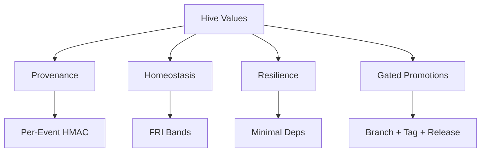
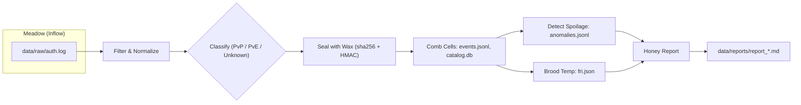
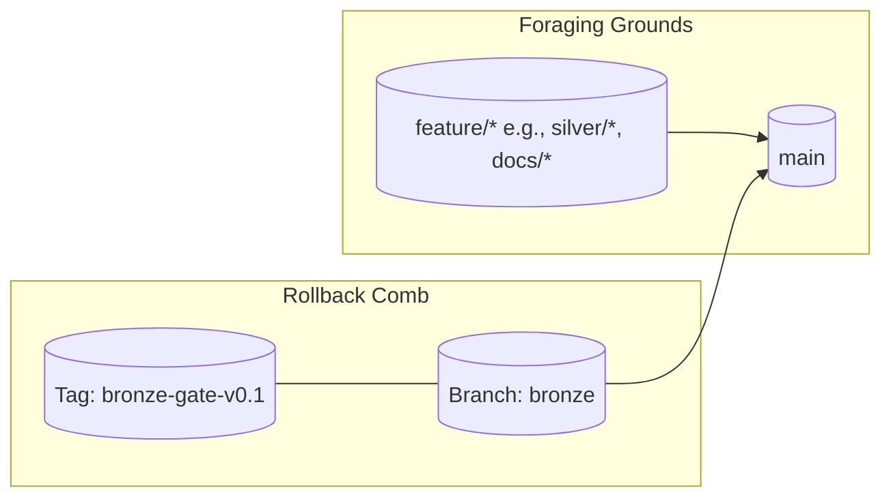
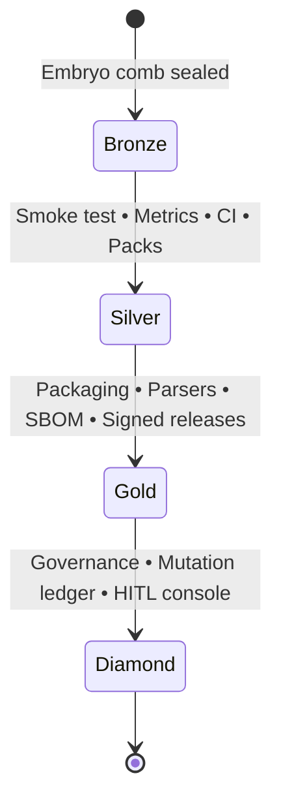

# 🐝🍯 **SWARMINT · AUTOPOIESIS** — *Hive-Born SIEM* 🍯🐝
> **Signal that survives noise.**  
> Honeycomb-themed, operator-first security telemetry: *forage* the logs, *filter* the noise, *seal* with provenance, *pour* honey (intel).

[](https://github.com/MYTHIK-blip/SWARMINT-AUTOPOIESIS/releases/tag/bronze-gate-v0.1)
[-8a2be2)](https://github.com/MYTHIK-blip/SWARMINT-AUTOPOIESIS/tree/bronze)
[](https://github.com/MYTHIK-blip/SWARMINT-AUTOPOIESIS/tree/main)


---
## 🧭 Table of Contents
- [Bronze Promotion Capsule](#-bronze-promotion-capsule)
- [Quickstart (Nectar in 60s)](#-quickstart-nectar-in-60s)
- [Feature Hive (Gates)](#-feature-hive-gates)
- [Hive Ethos (Principles → Practices)](#-hive-ethos-principles--practices)
- [Honeycomb Architecture (Bronze Snapshot)](#-honeycomb-architecture-bronze-snapshot)
- [Release Artifacts (Tarball Discipline)](#-release-artifacts-tarball-discipline)
- [Observability (Silver · Smoke Path)](#-observability-silver--smoke-path)
- [Security & Provenance Posture](#-security--provenance-posture)
- [Threat Model & Trust Boundaries](#-threat-model--trust-boundaries)
- [FRI — Definition & Tuning](#-fri-fracture-readiness-index--definition--tuning)
- [metrics.json (Silver Smoke) — v0.2](#-metricsjson-silver-smoke--v02)
- [Vectors & Use Cases (Expanded)](#-vectors--use-cases-expanded)
- [Attack Surface & Vectors](#-attack-surface--vectors)
- [Telemetry Ontology](#-telemetry-ontology)
- [Team Modes (Blue • Purple • Red • Honey)](#-team-modes-blue--purple--red--honey)
- [OPSEC & Handling](#-opsec--handling)
- [Alert Quality & SLOs](#-alert-quality--slos)
- [Config Profiles](#-config-profiles)
- [Data Retention & Privacy](#-data-retention--privacy)
- [Sample Report Snip](#-sample-report-snip)
- [Repo Layout (Comb Map)](#-repo-layout-comb-map)
- [Performance & Limits (Thermal Range)](#-performance--limits-thermal-range)
- [Failure Modes (Swarm Alarms)](#-failure-modes-swarm-alarms)
- [Non-Goals (Not This Hive)](#-non-goals-not-this-hive)
- [References (Curated)](#-references-curated)
- [Funding & Research](#-funding--research)
- [Contributing (Bee Dance)](#-contributing-bee-dance)
- [License & Attribution](#-license--attribution)
- [Bronze Invariants (Pinboard)](#-bronze-invariants-pinboard)

---

## 🧰 System Overview (As of 🟤 Bronze v0.1)

   

**What it is.** A provenance-first, homeostatic SIEM embryo that runs locally, tolerates degraded conditions, and outputs tamper-evident artifacts.

**What it does now (Bronze).**
- Ingests `auth.log` ➜ normalizes ➜ classifies (**PvP / PvE / Unknown**)
- Signs each event (**sha256 + HMAC**) and persists to `events.jsonl` + `catalog.db`
- Detects basic anomalies ➜ `anomalies.jsonl`
- Computes **FRI** (0–1) and **band** ➜ `fri.json`
- Renders a human report ➜ `data/reports/report_*.md`

**Artifacts you can trust.**
- Per-event HMAC; dataset SHA & `git rev` recorded in reports
- **Release tarball + SHA256SUMS** enables deterministic air-gap restore
- **Immutable rollback**: branch `bronze` and tag `bronze-gate-v0.1` pin an exact commit

**Operational posture.**
- Batch execution (`scripts/run_embryo.sh`), pure-Python; runs on small VMs
- No outbound telemetry; secrets stay local (`ops/secret.key`)
- Designed for DFIR kits, austere environments, and educator demos

**What it is not (yet).**
- Not a full EDR/SOAR or realtime distributed correlation engine
- Not shipping SBOM/signed releases (that’s **Gold**)

---

## 🐝 **Bronze Promotion Capsule**


- **State:** 🟤 *Bronze Gate v0.1 shipped* (immutable rollback line)  
- **Pins:** **branch** `bronze` ↔ **tag** `bronze-gate-v0.1` (same SHA)  
- **Artifacts:** curated **tarball** + **SHA256SUMS.txt** for deterministic air-gap restores  
- **Active dev:** `main` (toward **Silver · Smoke**)  
- **README:** enterprise-style, operator-first, mermaid diagrams, copy/paste blocks

**Verify the pins**
~~~bash
git fetch --all --tags
git rev-parse bronze-gate-v0.1^{}
git rev-parse origin/bronze
git rev-parse bronze
# ⤷ All three SHAs must match at Bronze
~~~

**Air-gap restore (release tarball)**
~~~bash
sha256sum -c SHA256SUMS.txt
tar -xzf SWARMINT-AUTOPOIESIS_bronze-gate-v0.1_src.tar.gz
cd SWARMINT-AUTOPOIESIS
python -m venv .venv && source .venv/bin/activate
pip install -r requirements.txt || true
bash scripts/run_embryo.sh
~~~

---

## ⚡ **Quickstart (Nectar in 60s)**


~~~bash
# 🐝 Clone the hive
git clone git@github.com:MYTHIK-blip/SWARMINT-AUTOPOIESIS.git
cd SWARMINT-AUTOPOIESIS

# 🍯 Prime the hive
python -m venv .venv && source .venv/bin/activate
pip install -r requirements.txt || true

# 🧪 Forage synthetic nectar
python -u scripts/sample_data.py

# 🔎 Spin the centrifuge (embryo run)
bash scripts/run_embryo.sh

# 📦 Skim the honey (artifacts)
ls -lh data/processed/{events.jsonl,anomalies.jsonl,fri.json}
ls -lh data/reports/
~~~

---

## 🍯 **Feature Hive (Gates)**


| Comb | Bronze | Silver | Gold | Diamond | Nectar Note |
|---|:---:|:---:|:---:|:---:|---|
| `auth.log` ingest | ✅ |  |  |  | One-shot runner |
| PvP / PvE / Unknown | ✅ | ⬜ |  |  | Packs + reclass arrive in Silver |
| HMAC per event | ✅ |  |  |  | Local key in `ops/secret.key` |
| FRI (band + value) | ✅ |  |  |  | Green / Yellow / Orange / Red |
| `metrics.json` | ⬜ | ✅ |  |  | Counts, FRI, input SHA, git rev |
| CI (ruff/mypy/pytest) | ⬜ | ✅ |  |  | Enforced on PRs (badges visible) |
| Parsers: journald/ufw/nginx |  |  | ✅ |  | Config-driven |
| SBOM + signed releases |  |  | ✅ |  | Supply-chain posture |
| Governance + mutation ledger |  |  |  | 💎 | Provenance lineage + HITL |

Legend: ✅ done • ⬜ planned for that gate • 💎 apex

---

## 🧠 **Hive Ethos (Principles → Practices)**


- **Forage with provenance** → per-event `sha256` + **HMAC** seals  
- **Keep the brood warm** → **FRI** compresses ambient risk to a posture band  
- **Swarm under constraint** → minimal deps, air-gap rituals, deterministic restore  
- **Comb discipline** → immutable rollback lines + deliberate promotions



---

## 🧱 **Honeycomb Architecture (Bronze Snapshot)**


**Narrative:** Logs are nectar. We filter, classify, sign, then concentrate into honey (intel) you can actually spread.



**Local vaults (git-ignored)**
~~~text
data/
  raw/auth.log
  processed/{events.jsonl, anomalies.jsonl, fri.json, catalog.db}
  reports/report_YYYY-MM-DD_HHMMSS.md
ops/secret.key   # HMAC key (NEVER commit)
~~~

---

## 🧰 **Release Artifacts (Tarball Discipline)**


- **Why tarball?** Reproducible hand-offs; deterministic restore; audit-friendly.  
- **What’s inside?** Source snapshot + pinned config; verify with `SHA256SUMS.txt`.  
- **How it complements apps?** Any downstream tool (dashboard, CLI, USB kit) can **trust the source** and redeploy without the network.

**Verify + restore**
~~~bash
sha256sum -c SHA256SUMS.txt
tar -xzf SWARMINT-AUTOPOIESIS_bronze-gate-v0.1_src.tar.gz
# ⤷ same results anywhere, even without Internet
~~~

---

## 👁️ **Observability (Silver · Smoke Path)**


**Goal:** A single **`metrics.json`** every run; humans glance, machines ingest.

~~~json
{
  "ts_utc": "2025-09-01T09:00:00Z",
  "git_rev": "dc99fd5",
  "input_sha256": "b3c1...f0a2",
  "counts": { "events": 4217, "anomalies": 32, "pvp": 19, "pve": 4178, "unknown": 20 },
  "fri": { "value": 0.62, "band": "Yellow" }
}
~~~

~~~bash
jq '.counts, .fri' data/processed/metrics.json
~~~

**Silver exit criteria**
- `metrics.json` emitted per run (schema stable)  
- CI gate on PRs: ruff + mypy + pytest (badges in README)  
- Classifier packs MVP + reclass history  
- Rollback invariants preserved

---

## 🛡️ Attack Surface & Vectors

 

**Primary vectors observed in auth logs**
- Brute-force & credential-stuffing bursts (spray, list attacks)
- Password-guessing on disabled/expired users; service/system accounts
- Lateral movement attempts (sudden cross-host login patterns)
- Privilege hunting (su/sudo escalations, non-interactive shells)
- Persistence setup (new keys, repeated failed logins followed by success)
- Log tampering indicators (gaps, truncation, out-of-order timestamps)

**Signals → Tactics mapping (indicative)**
| Signal | Likely Tactics | Notes |
|---|---|---|
| High fail rate from few IPs | Credential Access, Initial Access | Spray vs targeted (ratio of users per IP) |
| Many users from one geo/ASN | Recon, Credential Access | Correlate with ASN rarity |
| Off-hours lockouts | Impact, Defense Evasion | Escalate if followed by success |
| Unknown user bursts | Recon, Credential Access | Reclass or pack update in Silver |
| Sudden success after many fails | Credential Access, Lateral Movement | Weight in FRI lift |

---

## 🗂️ Telemetry Ontology


**Core entities**
- **Principal** (user/service), **Host**, **Session**, **Event**, **Artifact** (file/report), **Signature** (HMAC/sha256), **Anomaly**, **Metric**

**Event shape (Bronze) — subset**
```yaml
event:
  ts_utc: ISO8601
  host: string
  user: string | null
  src_ip: string | null
  action: "auth_success" | "auth_fail" | "lockout" | "sudo" | "unknown"
  status: "pvp" | "pve" | "unknown"
  reason: string | null        # template/dict name when known
  sha256: hex
  hmac: hex

---

## 🔵🟣🔴🍯 Team Modes (Blue • Purple • Red • Honey) — paste-ready

```md
## 🔵🟣🔴🍯 Team Modes

**Blue (defend)**
- Read **FRI band** as posture; triage top anomalies; check burst windows
- Actions: lock offending accounts; rotate keys; verify sudoers changes

**Purple (tune)**
- Convert recurring “Unknown” patterns into **dictionary packs**
- Adjust **FRI weights** per environment; document before/after metrics

**Red (exercise)**
- Run controlled sprays with unique markers; ensure reports show separation
- Target SLOs: Blue detects within N minutes; FRI crosses Yellow→Red

**Honey (deception)**
- Seed decoy users/keys; mark in packs as **decoy**
- Alerts: any success on decoy → immediate Red band lift

---

## 🕶️ OPSEC & Handling


- **Keys:** `ops/secret.key` local only; `chmod 600`; rotate on any suspicion
- **Reports:** redact usernames/IPs before sharing externally (keep a sealed copy)
- **Samples:** sanitize `auth.log` before committing; never push live secrets
- **PR hygiene:** no output artifacts in PRs (only schemas/code)
- **Air-gap:** prefer the release tarball + checksums for cross-org transfer

---

## 🧯 Alert Quality & SLOs

**Quality targets (initial)**
- Precision (manual spot-check): ≥ 0.75 on “Top 10 anomalies”
- Recall (scenario drill): detect ≥ 80% of injected attack windows
- MTTR proxy: time from Red FRI to human acknowledgement ≤ 30 min

**Operational knobs**
- Tune FRI weights; increase `unknown_lift` for noisy environments
- Suppress repetitive benign templates by promoting them to packs (Silver)
---

## ⚙️ Config Profiles

```yaml
profiles:
  austere:
    fri: { unknown_lift: 0.25 }
    parse: { strict: false }
  default:
    fri: { unknown_lift: 0.20 }
  verbose:
    fri: { unknown_lift: 0.10 }
    detect: { burst_window_min: 1, sensitivity: high }
---

## 🧪 Sample Report Snip

```text
SWARMINT-AUTOPOIESIS — report_2025-08-29_073245.md
git_rev: dc99fd5  input_sha256: b3c1...f0a2

FRI: 0.62 (Yellow)
Top anomalies:
 - 02:14–02:18Z: 146 auth_fail from 2 IPs → 11 users (spray)
 - 03:52Z: sudo escalation attempt (invalid tty) → user: svc-backup
 - 04:05Z: lockouts=4 on off-hours window

---

## 🛡️ **Security & Provenance Posture**


- **Per-event seals:** sha256 + **HMAC** on canonicalized payloads  
- **Key handling:** `ops/secret.key` is local only (`chmod 600`); rotate on exposure  
- **Supply chain roadmap:** SBOM + signed tags/releases (Gold), attestations later

**Generate/rotate key**
~~~bash
mkdir -p ops && umask 077
openssl rand -hex 32 > ops/secret.key
chmod 600 ops/secret.key
~~~

---

## 🌳 **Branch & Tag Topology (Hive Roles)**




**Contract**
- `bronze` = immutable rollback branch (no direct commits; no force-push)  
- `bronze-gate-v0.1` = tag pointing to exact Bronze commit  
- `main` = living trunk; feature work in `silver/*` or `docs/*` → PR → **squash** to `main`

---

## 🛣️ **Roadmap (Foraging Seasons)**




---

## 🧰 **Operator Crib (Keeper Tools)**


**Run embryo with sample nectar**
~~~bash
python -u scripts/sample_data.py
bash scripts/run_embryo.sh
~~~

**Inspect honey**
~~~bash
head -n 3 data/processed/events.jsonl
cat data/processed/fri.json
ls -lh data/reports/
~~~

**Dataset fingerprint**
~~~bash
sha256sum data/raw/auth.log 2>/dev/null || echo "no local auth.log"
git rev-parse --short HEAD
~~~

---

## 📦 **Repo Layout (Comb Map)**


~~~text
config/
  process.yaml
  schema/
    event.schema.json
    anomaly.schema.json
scripts/
  run_embryo.sh
  ingest.py
  fri.py
  report.py
  sample_data.py
data/                 # LOCAL VAULT (gitignored)
  raw/                #   inputs (e.g., auth.log)
  processed/          #   events.jsonl, anomalies.jsonl, catalog.db, fri.json
  reports/            #   report_*.md
ops/
  secret.key          # HMAC key (local only)
tests/                # schemas + ingest checks
.github/
  ISSUE_TEMPLATE/     # optional; CI arrives in Silver
.pre-commit-config.yaml
.ruff.toml
.mypy.ini
requirements.txt
README.md
~~~

---

## ⚖️ **Performance & Limits (Thermal Range)**


- Low-footprint Bronze (pure Python) on modest VMs  
- Batch pipeline (not a realtime daemon yet)  
- Single-host focus across Bronze/Silver; multi-hive correlation later

---

## 🧯 **Failure Modes (Swarm Alarms)**


- **Missing `ops/secret.key`** → HMAC absent → generate/rotate and rerun  
- **No outputs** → wrong/empty input path → confirm `data/raw/auth.log`  
- **No report** → check `logs/` & stderr → ensure runner completed  
- **Render weird on GitHub** → ensure fences open/close; leave blank lines around lists/blocks

---

## 🚫 **Non-Goals (Not This Hive)**


- Full EDR/SOAR replacement or deep endpoint forensics  
- Realtime distributed SIEM correlation  
- Cloud-only pipelines — this hive is **local-first / air-gap-friendly**

---
## 🌐 Vectors & Use Cases (Expanded)

- 🏛️ **Civic / Gov** — Credential-stuffing & weak-password storms across council portals; summarize posture via **FRI band** + top anomalies; produce offline Markdown for governance packs.
- 🧪 **DFIR / Incident Response** — Air-gapped triage of seized images: deterministic JSONL + SHA-pinned report enable chain-of-custody friendly briefs.
- 🏥 **Healthcare** — Shift-change spikes (failed logins, lockouts) tracked to **Yellow/Orange FRI** without flooding NOC; artifact bundle suits on-call handover.
- ⚙️ **OT / ICS edge** — SSH on gateway nodes; no network dependency; emit compact **metrics.json** for fleet dashboards later.
- 🧰 **SME / Enterprise-lite** — Weekend brute spikes → owner-readable Markdown; “no vendor console required.”
- ⛰️ **Field / Austere** — Runs from a USB in intermittent networks; reports readable offline.
- 🎓 **Education / Labs** — Synthetic log corpus for “explain this report” exercises; compare detector flags against labeled windows.
- 🇳🇿 **NZ orientation** — Compatible with civic data workflows used in adjacent projects (CDEM, GeoNet/LINZ/LAWA), while SWARMINT itself stays **local-first** and air-gap-friendly.

---

## 📚 References

### 🔎 Log parsing & log anomaly detection
- **DeepLog: Anomaly Detection and Diagnosis from System Logs** — LSTM sequence modeling; seminal baseline for log-sequence AD. (KDD’17).  [arXiv/Utah PDF] :contentReference[oaicite:0]{index=0}
- **LogBERT: Log Anomaly Detection via BERT** — self-supervised masked/next-event tasks on logs; strong SOTA style. (2021).  [arXiv abs] :contentReference[oaicite:1]{index=1}
- **Deep Learning for Anomaly Detection in Log Data: A Survey** — broad review of deep models & pipelines. (2022).  [arXiv] :contentReference[oaicite:2]{index=2}
- **Log-based Anomaly Detection with Deep Learning** — compact survey + comparative framing. (2022).  [arXiv PDF] :contentReference[oaicite:3]{index=3}
- **Drain: An Online Log Parsing Approach** — widely-used streaming template parser; pairs well with DeepLog-style pipelines. (ICWS’17).  [paper PDF] :contentReference[oaicite:4]{index=4}
- **Practitioners’ Expectations on Log Anomaly Detection** — empirical study (312 practitioners); gap analysis vs research. (2024).  [arXiv] :contentReference[oaicite:5]{index=5}

### 🔐 Provenance & supply-chain integrity
- **in-toto: Providing farm-to-table guarantees for bits & bytes** — cryptographically verified build/CI chains. (USENIX Security’19).  [paper] :contentReference[oaicite:6]{index=6}
- **The Update Framework (TUF)** — resilient software update model (roles, delegations, compromise recovery). (spec & pubs).  [site / pubs] :contentReference[oaicite:7]{index=7}
- **SLSA: Supply-chain Levels for Software Artifacts** — defense-in-depth maturity rubric for build provenance. (framework).  [slsa.dev] :contentReference[oaicite:8]{index=8}
- **Analyzing Challenges in Deployment of SLSA** — adoption study across 1,523 GitHub issues. (2024).  [arXiv] :contentReference[oaicite:9]{index=9}

### 🧾 SBOM & standards
- **NTIA: Minimum Elements for an SBOM** — foundational guidance. (2021).  [NTIA] :contentReference[oaicite:10]{index=10}
- **CISA: 2025 Minimum Elements for an SBOM (update)** — current USG refresh; useful for roadmap notes. (2025).  [CISA] :contentReference[oaicite:11]{index=11}
- **SPDX / CycloneDX** — de-facto SBOM formats (spec sites).  [link from your docs later]

### ☁️ Threat intel exchange & mapping
- **STIX 2.1 (OASIS Standard)** — CTI language; final 2.1 spec. (2021).  [OASIS] :contentReference[oaicite:12]{index=12}
- **TAXII 2.1 (OASIS Standard)** — CTI transport (REST). (2021).  [OASIS] :contentReference[oaicite:13]{index=13}
- **STIX 2.1 Best Practice Guide** — pragmatic authoring guidance. (CISA 2022).  [PDF] :contentReference[oaicite:14]{index=14}
- **MITRE ATT&CK** — tactic/technique matrix for mapping anomalies to adversary behaviors. (living KB).  [site] :contentReference[oaicite:15]{index=15}

> Tip: keep these in `docs/REFERENCES.md` with short 1-line takeaways; link that file from the README.


## 🤝 **Contributing (Bee Dance)**


~~~bash
# 🌱 Start a short-lived branch
git switch -c docs/readme-honey   # or: silver/smoke-v0.2

# ✍️ Edit + preview (VS Code: Ctrl/Cmd-K V), then commit
git add README.md
git commit -m "docs: SIEM-themed honeycomb README"
git push -u origin HEAD

# 🔎 Open a PR to main
gh pr create -f -B main -t "docs: SIEM honeycomb README" -b "Emoji badges, mermaid, Bronze capsule."
~~~

**Style:** `feat:`, `fix:`, `docs:`, `chore:`, `ci:`, `sec:` (+ 🐝 welcome)

---

## 🧭 References (Curated)

> Handpicked research & standards that inform SWARMINT’s design. Skim the bullets; follow the links when you want deeper proofs or patterns.

### 📜 Log parsing & log anomaly detection
- **DeepLog** — LSTM sequence modeling; seminal baseline for log-sequence AD (KDD’17). [paper] :contentReference[oaicite:0]{index=0}  
- **LogBERT** — masked/next-event prediction on logs; strong results (2021). [arXiv] :contentReference[oaicite:1]{index=1}  
- **DRAIN (ICWS’17)** — widely-used streaming log template parser; pairs well with DeepLog-style pipelines. [paper PDF] :contentReference[oaicite:2]{index=2}  
- **Survey (2022)** — broad review of deep log AD methods & pipelines. [arXiv] :contentReference[oaicite:3]{index=3}  

### 🔐 Provenance & software supply-chain integrity
- **in-toto (USENIX Security’19)** — cryptographically verifiable supply-chain steps. [paper] :contentReference[oaicite:4]{index=4}  
- **SLSA** — maturity levels for build provenance (framework). [site] :contentReference[oaicite:5]{index=5}  
- **TUF** — resilient update framework; survives partial compromise. [spec/home] :contentReference[oaicite:6]{index=6}  

### 🧾 SBOM & standards
- **NTIA: Minimum Elements for an SBOM (2021)** — foundational guidance. [PDF] :contentReference[oaicite:7]{index=7}  
- **CISA: 2025 SBOM update (overview)** — current U.S. refresh; useful for roadmaps. [site] :contentReference[oaicite:8]{index=8}  
- **SPDX** — de-facto SBOM format (specs). [site] :contentReference[oaicite:9]{index=9}  
- **CycloneDX** — compact, security-focused SBOM (specs). [site] :contentReference[oaicite:10]{index=10}  

### 🛰️ Threat intel exchange & mapping
- **STIX™ 2.1 (OASIS Standard)** — CTI objects & patterning. [PDF] :contentReference[oaicite:11]{index=11}  
- **TAXII™ 2.1 (OASIS Standard)** — CTI transport (REST). [PDF] :contentReference[oaicite:12]{index=12}  
- **MITRE ATT&CK®** — tactics/techniques knowledge base. [site] :contentReference[oaicite:13]{index=13}  

### 📈 Observability & exporters (for Silver+)
- **OpenTelemetry Logs — data model & semantics** (stable). [spec] :contentReference[oaicite:14]{index=14}  
- **Prometheus textfile collector** — emit metrics.json → Node Exporter. [docs] :contentReference[oaicite:15]{index=15}  
- **Grafana Loki** — label-indexed log aggregation; cost-effective design. [docs] :contentReference[oaicite:16]{index=16}  

### 🛡️ Incident response, logging & secure development
- **NIST SP 800-92** — Guide to Computer Security Log Management (classic). [PDF] :contentReference[oaicite:17]{index=17}  
- **NIST SP 800-61r3 (2025)** — Incident response profile aligned to CSF 2.0. [PDF] :contentReference[oaicite:18]{index=18}  
- **NIST SP 800-218 (SSDF v1.1)** — secure software development framework. [PDF] :contentReference[oaicite:19]{index=19}  

### 🧪 Reproducible builds & checksum verification (air-gap friendly)
- **Reproducible Builds — definitions & practices.** [docs] :contentReference[oaicite:20]{index=20}  
- **Verifying SHA-256SUMS** — practical check flow. [how-to] :contentReference[oaicite:21]{index=21}  

### 🧠 Remote attestation & evidence chain-of-custody
- **Evidence Tampering & Chain of Custody in Layered Attestations (2024)** — formalizes tamper opportunities (TOP), tamper strategies (TSP), and evidence-protecting programs (EPPP) in Copland; includes Coq proofs. :contentReference[oaicite:22]{index=22} :contentReference[oaicite:23]{index=23}  

### 🤝 Multi-agent coalitions (for future “swarm/coordination” heuristics)
- **Detecting & Identifying Coalitions (AAAI Workshop 2011)** — clusters in “benefit space” to spot collusion without plan knowledge; good inspiration for PvP/PvE group-behavior flags. :contentReference[oaicite:24]{index=24} :contentReference[oaicite:25]{index=25}


## 📜 **License & Attribution**


**MIT** — see `LICENSE`.  
Author: **Kerehama Mcleod (MYTHIK-blip / _MYTHIK_)**

**Cite (Bronze release)**
~~~bibtex
@software{swarmint_autopoiesis_bronze_v0_1_2025,
  author  = {Mcleod, Kerehama},
  title   = {SWARMINT-AUTOPOIESIS: Hive-born, homeostatic SIEM embryo},
  year    = {2025},
  version = {bronze-gate-v0.1},
  url     = {https://github.com/MYTHIK-blip/SWARMINT-AUTOPOIESIS},
  note    = {Immutable rollback branch: bronze; air-gap tarball + checksums}
}
~~~

---

## ✅ **Bronze Invariants (Pinboard)**


- [ ] `bronze` branch protected; matches tag `bronze-gate-v0.1`  
- [ ] Release includes tarball + `SHA256SUMS.txt`  
- [ ] `.gitignore` covers `data/`, caches, and `ops/secret.key`  
- [ ] README renders clean (badges, mermaid, fenced blocks)  
- [ ] No mixed HTML; blank lines around lists/blocks

---

## 🛣️ Future Iterations & Promotions

   

**Promotion ritual (every gate).**
1) Meet exit criteria
2) Tag `*-gate-vX.Y`
3) Create immutable rollback branch (`bronze`, later `silver`)
4) Attach release tarball + `SHA256SUMS.txt`
5) Protect branch (no direct pushes, PRs only)

**Exit criteria highlights**
- **Silver (v0.2 — “Smoke”)**: `metrics.json` per run; CI gates (ruff, mypy, pytest); classifier packs MVP; docs updated  
- **Gold (v0.3)**: Docker packaging; parsers (`journalctl`, `ufw`, `nginx`); SBOM + signed releases  
- **Diamond (v1.0)**: Mutation budgets & provenance lineage; HITL triage console

---

## 💸 Funding & 🔬 Research

 

**Why fund this?**  
Resilient, **air-gap-friendly** telemetry with tamper-evident artifacts and clean rollback lines. Designed for civic ops, DFIR, SMEs, and austere deployments.

**Ways to support**
- GitHub Sponsors / Open Collective *(links to be added)*  
- Grants or research co-funding *(security + provenance + civic resilience)*  
- Hardware kits for austere field testing

**Research collaboration areas**
- Log anomaly detection under **partial compromise** and **intermittent networks**
- Evidence **chain-of-custody** and layered attestations (pair with SBOM/SLSA)
- Human-readable posture metrics (FRI) vs task success in IR drills
- Dataset contributions: sanitized `auth.log` snapshots with labeled episodes

**How to cite**
See the **Cite (Bronze)** BibTeX in the License section. A “Cite (Silver)” entry will accompany the next promotion.

---
